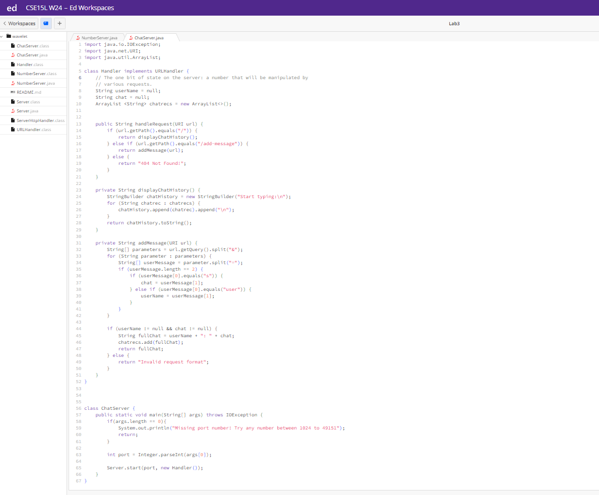
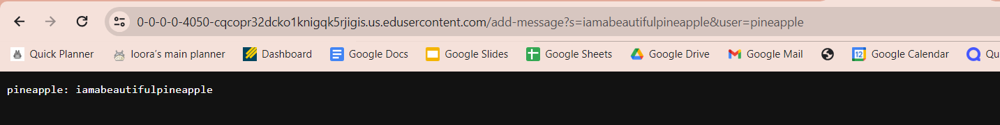
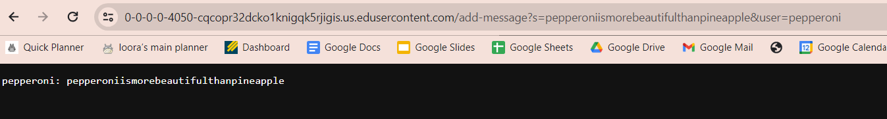
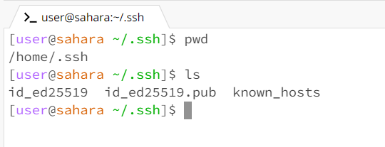
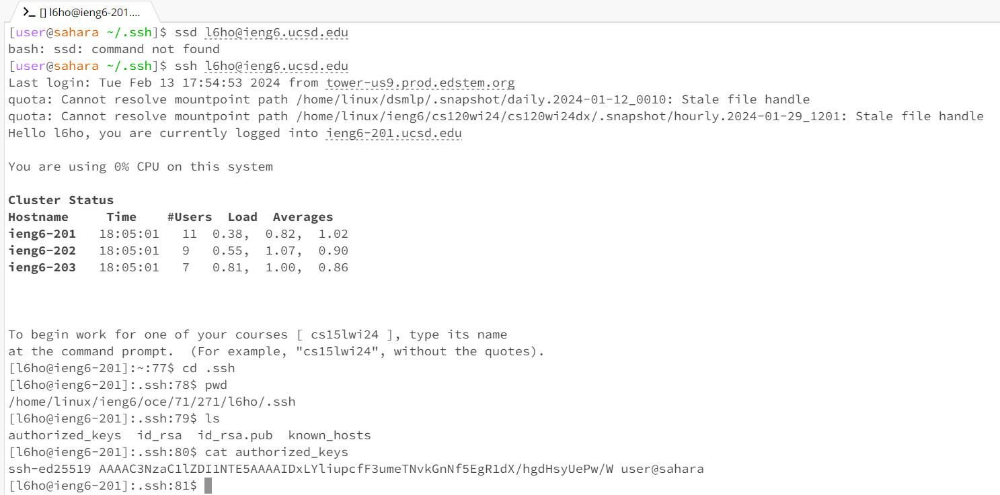

# lab-report-2
By Laura Ho

# part-1

Here is the `ChatServer.java` Code: 

```
import java.io.IOException;
import java.net.URI;
import java.util.ArrayList;

class Handler implements URLHandler { 
    // The one bit of state on the server: a number that will be manipulated by
    // various requests.
    String userName = null;
    String chat = null; 
    ArrayList <String> chatrecs = new ArrayList<>();


    public String handleRequest(URI url) {
        if (url.getPath().equals("/")) {
            return displayChatHistory();
        } else if (url.getPath().equals("/add-message")) {
            return addMessage(url);
        } else {
            return "404 Not Found!";
        }
    }

    private String displayChatHistory() {
        StringBuilder chatHistory = new StringBuilder("Start typing:\n");
        for (String chatrec : chatrecs) {
            chatHistory.append(chatrec).append("\n");
        }
        return chatHistory.toString();
    }

    private String addMessage(URI url) {
        String[] parameters = url.getQuery().split("&");
        for (String parameter : parameters) {
            String[] userMessage = parameter.split("=");
            if (userMessage.length == 2) {
                if (userMessage[0].equals("s")) {
                    chat = userMessage[1];
                } else if (userMessage[0].equals("user")) {
                    userName = userMessage[1];
                }
            }
        }

        if (userName != null && chat != null) {
            String fullChat = userName + ": " + chat;
            chatrecs.add(fullChat);
            return fullChat;
        } else {
            return "Invalid request format";
        }
    }
}


class ChatServer {
    public static void main(String[] args) throws IOException {
        if(args.length == 0){
            System.out.println("Missing port number! Try any number between 1024 to 49151");
            return;
        }

        int port = Integer.parseInt(args[0]);

        Server.start(port, new Handler());
    }
}
```
Image of Dictories and Code: 


**Screenshot 1: Add Message #1** 

1) Which methods in your code are called: 
  `public String handleRequest(URI url)` and `private String addMessage(URI url)` was called
2) What are the relevant arguments to those methods, and the values of any relevant fields of the class:
  The relevant argument followed the input `/add-message?s=<String>&user=<String>`. This allows the user to input a message as indicated by `s=` under a specified name through `user=`. In this case, `s=iamabeautifulpineapple` creates a messages of `iamabeautifulpineapple`, and `user=pineapple` creates the user `pineapple`.
3) How do the values of any relevant fields of the class change from this specific request? If no values got changed, explain why:
  The only fields changed were `userName` and `chat` as they were updated upon setting `userName` to `pineapple` and `chat` to `iamabeautifulpineapple`.

**Screenshot 2: Add Message #2**

1) Which methods in your code are called:
    `public String handleRequest(URI url)` and `private String addMessage(URI url)` was called
3) What are the relevant arguments to those methods, and the values of any relevant fields of the class:
  The relevant argument followed the input `/add-message?s=<String>&user=<String>`. This allows the user to input a message as indicated by `s=` under a specified name through `user=`. In this case, `s=pepperoniismorebeautifulthanpineapple` creates a messages of `pepperoniismorebeautifulthanpineapple`, and `user=pepperoni` creates the user `pepperoni`.
5) How do the values of any relevant fields of the class change from this specific request? If no values got changed, explain why.
  The only fields changed were `userName` and `chat` as they were updated upon setting `userName` to `pepperoni` and `chat` to `pepperoniismorebeautifulthanpineapple`.

# part-2
1) The absolute path to the private key for your SSH key for logging into ieng6 (on your computer, an EdStem workspace, or on the home directory of the lab computer)

`/home/.ssh/id_ed25519.pub`



2) The absolute path to the public key for your SSH key for logging into ieng6 (this is the one you copied to your account on ieng6, so it should be a path on ieng6's file system)

`/home/linux/ieng6/oce/71/271/l6ho/.ssh/authorized_keys`



3) A terminal interaction where you log into your ieng6 account without being asked for a password.


# part-3
I learned plentiful--and I anticipate being amazed once again! I do not have the best technological intuition, so a lot of the material covered in the past two weeks was relatively foreign and took a while to grasp. The two things I struggled with the most: 1) understanding how to activate my personal server and 2) commands in the URL. It was bewildering that I would be access my own "website" by entering a few lines into the terminal and a random number combination as a port. I was also amazed by the different commands found in both my `ChatServer.java` and `NumberServer.java`, such as `/increment` from the `NumberServer.java` or `/add-message` from the `ChatServer.java`. I enjoyed these past few weeks, and I look forward to more. 
