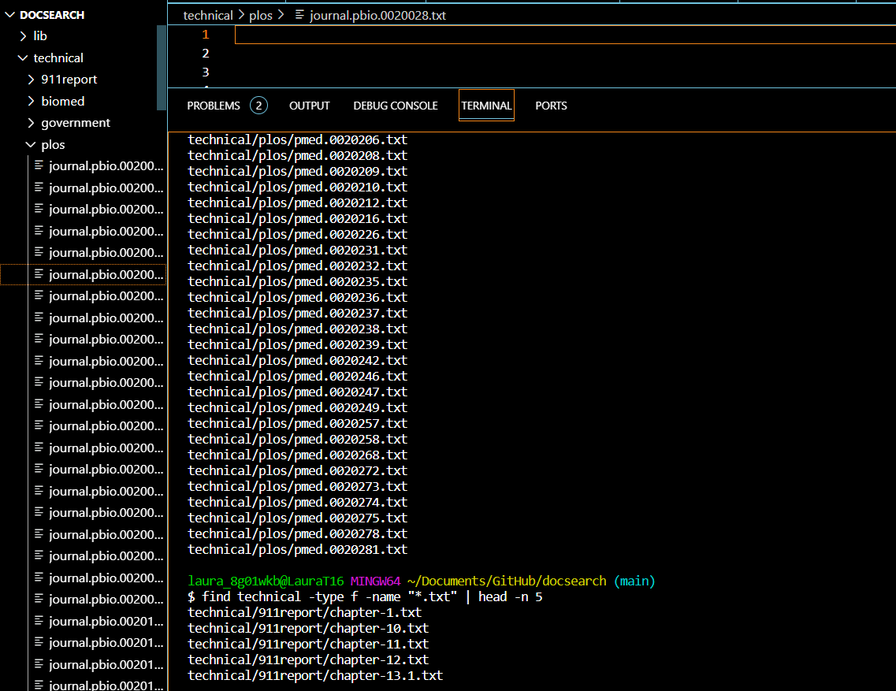

# lab-report-3
By Laura Ho

# part-1
 
 * A failure-inducing input for the buggy program, as a JUnit test and any associated code (write it as a code block in Markdown)

The failure-inducing input is derived from the test cases involving returning the arrays in a reversed order, particularly with the `reverseInPlace(int[] arr)` method.

```
@Test
public void reverseInPlace2() {
  int[] input1 = {1, 2, 3, 4, 5};
  ArrayExamples.reverseInPlace(input1);
  assertArrayEquals(new int[]{5, 4, 3, 2, 1}, (input1));
}
@Test
public void reverseInPlace3() {
  int[] input1 = {2,2,2};
  ArrayExamples.reverseInPlace(input1);
  assertArrayEquals(new int[]{2,2,2}, (input1));
}
@Test
public void reverseInPlace4() {
  int[] input1 = {5};
  ArrayExamples.reverseInPlace(input1);
  assertArrayEquals(new int[]{5}, (input1));
 }
}
```

* An input that doesn't induce a failure, as a JUnit test and any associated code (write it as a code block in Markdown)

```
@Test 
public void testReverseInPlace() {
  int[] input1 = { 3 };
  ArrayExamples.reverseInPlace(input1);
  assertArrayEquals(new int[]{ 3 }, input1);
}
```

* The symptom, as the output of running the tests (provide it as a screenshot of running JUnit with at least the two inputs above)

Here is JUnit on the Directory bar:


Here is the output in the terminal: 


As shown above, only the test `testReverseInPlace` passed the bugged code, but the other tests including `reverseInPlace2`, `reverseInPlace3`, and `reverseInPlace4` do not pass the bugged code. 

* The bug, as the before-and-after code change required to fix it (as two code blocks in Markdown)

In this situation, we will be fixing the class `ArrayExamples`, specifically the `reverseInPlace(int[] arr)` method. 

Before fixes: 
```
  // Changes the input array to be in reversed order
  static void reverseInPlace(int[] arr) {
    for(int i = 0; i < arr.length; i += 1) {
      arr[i] = arr[arr.length - i - 1];
    }
  }
```

After fixes: 

```
  // Changes the input array to be in reversed order
  static void reverseInPlace(int[] arr) {
    int[] copyArr = new int[arr.length];

    for(int i = 0; i< arr.length; i += 1) {
      copyArr[i] = arr[arr.length - i - 1]; 
    }
    for (int i = 0; i < arr.length; i++) {
      arr[i] = copyArr[i]; 
    }
  }
}
```
Here is the new output, showing the bugs have been fixed:


* Why the fix addresses the issue:
> The bugged code does not create a copy of the array, and therefore the bug specifically lies in the `arr[i] = arr[arr.length - i - 1];`. This is because `arr[i]` is set to `arr[arr.length - i - 1]`, but because there is no copy of the old array, we do not preserve the data value of `arr[i]`. To fix this, I create a copy of the array to store `arr[i]` and thus replace the old line of code with `copyArr[i] = arr[arr.length - i - 1];`. Then, I reassign the modified values in `copyArr[i]` back to `arr[i]`. 

# part-2
Selected command: find 

1. Find files relating to a specific type
> Source: OpenAI(2022), [ChatGPT](https://chat.openai.com/)
> According to ChatGPT, the overall formatting command is as follows: `find /path/to/directory -type f- name "*.txt"` 

a) In this screenshot, I used the command `find technical/ -type f -name "*.txt"` and added `|head -n 5` to restrict the output of files listed in the terminal to only the first five files. This command searches through all the existing files that are labeled as txt files (hence, `-type f` for searching through all the files and `-name "*.txt"` to look through the txt files). This is performed in the `technical` directory. This is useful because this sorts through all the existing files for a specific file type, in this case the txt files which are signified by being labeled with the ending of ".txt". 

 

b) In this screenshot, I used the command `find technical/ -type f -name "*.0020028.txt".` This command searches through all the existing files that are labeled as "0020029.txt" (hence, `-type f` for searching through all the existing files and `-name "*.0020028.txt"` to look through the txt files that contain "0020028"). This is performed in the `technical` directory. This is useful because this sorts through all the existing files for a specific file type, in this case the specific txt files within the "0020028" group which are signified by being labeled with the ending of "0020028.txt". 

 

2. Find files modified previously within a specific timeframe
> Source: OpenAI(2022), [ChatGPT](https://chat.openai.com/)
> According to ChatGPT, the overall formatting command is as follows: `find /path/to/directory -mtime +/- (number of days)`
> If one wishes to find files last modified within a specific interval, then folow this command format: `find /path/to/directory -mtime (-number of days, upper bound) -a -mtime (+number of days, lower bound)`

a) This screenshot shows the command `find technical/ -mtime -24` with the command `|head -n 5` added at the end to restrict the files listed to the first five only. This command searches for all existing files that were last modified in the previous 24 days. It is useful because it enables one to access information are most recently created/updated. This can help to source as to where potential problems may arise in web software by understanding the timeline of files added or updated. 

 

b) This screenshot shows the command `find technical/ -mtime -20 -a -mtime +4` with the command `|head -n 10` added at the end to restrict the files listed to the first ten only. This command searches for all existing files that were last modified within this timeframe interval of "4 days < x < 20 days". In other words, this searches for files last updated over four days ago, but less than twenty days ago. It is useful because it enables one to access information are most recently created/updated in an even more specific timeframe. This can help to source as to where potential problems may arise in web software by understanding the timeline of files added or updated. 

 

3) Find files larger or smaller than specified size
> Source: OpenAI(2022), [ChatGPT](https://chat.openai.com/)
> According to ChatGPT, the overall formatting command is as follows: `find /path/to/directory -type f -size +/- 10k`
> If one wishes to find files ranging within a specific size interval, then folow this command format: `find /path/to/directory -size (+size, lower bound) -a -size (-size, upper bound)`

a) This screenshot shows the command `find technical/ -type f -size +20k` with the command `| head -n 15` added at the end to restrict the files listed in the terminal to only the first fifteen. This command searches through all the existing files that are greater than 20 kilobytes (hence, `-size +20k`). This is useful because one can determine which files are too large for a specific software that they are attempting to build or input that is limited to a certain file size.

 

b) This screenshot shows the command `find technical/ -type f -size +5k -a -size -100k` with the command `| head -n 15` added at the end to restrict the files listed in the terminal to only the first fifteen. This command searches through all the existing files thatare greater than 5 kilobytes (hence, `-size +5k`) and less than 100 kilobytes (hence, `-size -100k`. This is useful because one can determine which files are just the right size for a specific software that they are attempting to build or input that is limited to a certain file size, or even too large or too small for the software. 

 

4) Find files that are *not* the specified file type
> Source: OpenAI(2022), [ChatGPT](https://chat.openai.com/)
> According to ChatGPT, the overall formatting command is as follows: `find /path/to/search -not -name "*.txt"`

a) This screenshot shows the command `file technical/ -not -name "*.txt"` with no output restriction at the end given that we previously discovered that the `technical/` directory has many txt files. This command searches through all the existing files that are not txt files. This can be useful if one is looking for other existing files that are not as frequent or may be hidden among a mass of repeated file types (like the mass of txt files). 

 

b) This screenshot shows the command `file technical/ -not -name "*.JPG"` with the command `| head -n 10` added at the end to restrict the files listed in the terminal to only the first ten. This command searches through all the existing files that are not JPG files. This can be useful if one is looking for other existing files without having to manually sort or scroll through different files. 

`file technical/ -not -name "*.JPG" | head -n 10`
 
