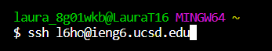
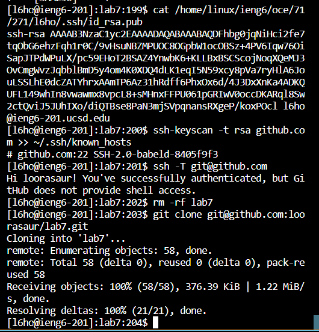
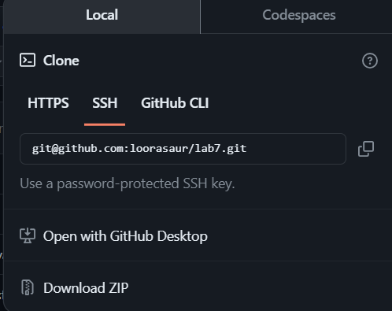
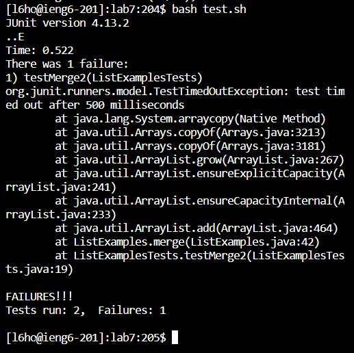
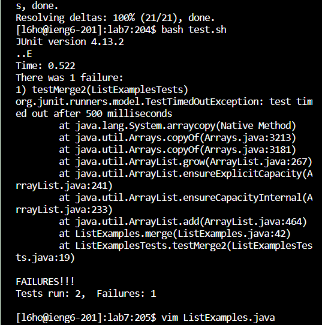
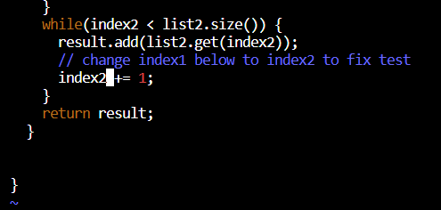
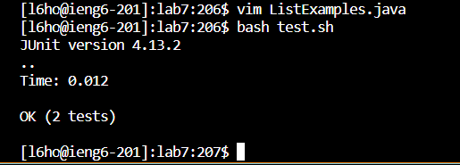
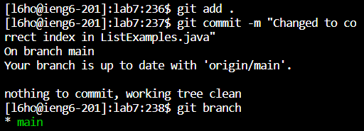
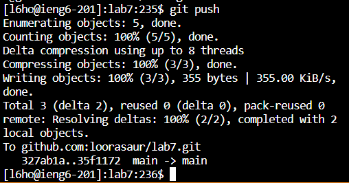

# lab-report-4
By Laura Ho

1. Log into ieng6

For this, I typed `ssh l6ho@ieng6.ucsd.edu` into the terminal. I could also do this same step by searching through the terminal history using `<up> <Enter>` until I found the same line, since I would have previously used this command during the setup. 

> 

2 Clone your fork of the repository from your Github account (using the SSH URL)

After making my SSH key through github, I ensured that it was deleted before I could clone it with the command `rm -rf lab7`. Then, I used the SSH URL from GitHub for my forked repository as follows: `git@github.com:loorasaur/lab7.git`. After copying the SSH URL from my forked repository, I clone it in my ieng6 terminal with the following commands: `git clone <CTRL+V> <Enter>`. 

This image shows the commands running through the terminal. 

> 

This is my SSH URl from my forked repository for further reference. 

> 

3. Run the tests, demonstrating that they fail

If not previously already in the `lab7` directory, ensure to switch into the correct directory with the command: `cd lab7 <Enter>`. I have already switched into the `lab7` directory. 

For this step, I run the tests and determine that they are failing by running this command in the terminal: `bash test<Tab> <Enter>`. The output is also included in the screenshot below. 

> 

4. Edit the code file to fix the failing test

To fix this, I first access the `ListExamples.java` file with this command: `vim L<Tab>.java <Enter>` 

I search for the `index1` to be edited in this file with this command: `<n> <n> <n> <n> <n> <n> <n> <n> <n>`. 

I then edit `index1` to `index2` as shown in the screenshot by starting at the end of the word with the command `<e>`, moving one step to the left to ensure that the cursor hovers over the `1` of `index1` using the command `<h>`. Then, I delete the `1` using `<x>` and change it to `2` so that it appears as `index2`. Now, I exit the editing mode with the command `<Esc>`. 

Finally, I save my edits with the command `:wq <Enter>`. 

In this first screenshot, I utilize the `vim` command. 

> 

In this second screenshot, I have modified `index1` to `index2`. 

> 

5. Run the tests, demonstrating that they now succeed

I type this command into the terminal: `bash test.sh`. This can also be achieved by searching through the terminal history for the same command `<up> <up> <Enter>`. All the tests are shown to have passed. 

> 

6. Commit and push the resulting change to your Github account (you can pick any commit message!)

I first initiate a command to stage the changes made to the file: `git add` 

Then, I commit these staged changed with a custom commit message: `git commit -m "Changed tp correct index in ListExamples.java"` 

I will check the branch that I am currently working in: `git branch`

I will finalize my changes by pushing my committed changes to my GitHub forked repository: `git push` 

The command `git push origin main` would also work in this situation. 

> 

> 
