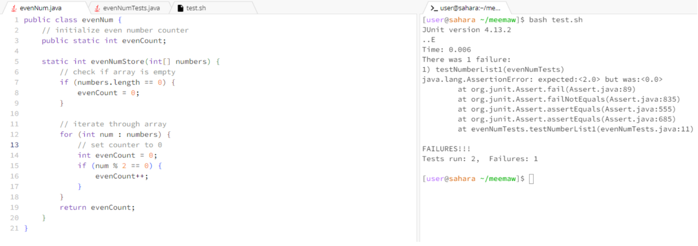
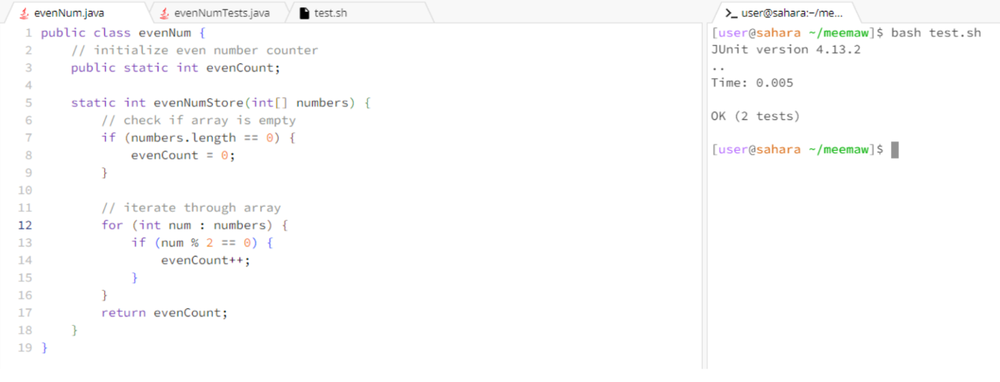
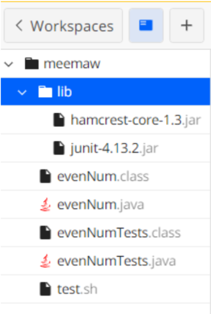

# lab-report-5
By Laura Ho

## part-1.1: debugging scenario 
**EdStem Post:**

Test Failure Even Counter Help 

*Anonymous* 

> Hello!
> When I am testing my evenNum class, I am receiving a failure on one of my tests that I am
> struggling to debug. My class is meant to count the number of even numbers in an array, then
> return that value. In one of my tests, I am expecting the value 2 for the number of even numbers
> in a test array of {2, 9, 9, 8, 4}, but instead I am getting 1. What can I do to debug this?



*TA Response*

> I will need more information to help debug this problem. Could you send your code for the test
> file and evenNum file?

*Student Response* 
> Of course! Here is my code for the evenNum class. It is meant to iterate through an array of
> numbers, and for numbers that are even, it will increment my count variable by 1.

```
public class evenNum {
    // initialize even number counter
    public static int evenCount; 

    static int evenNumStore(int[] numbers) {
        // check if array is empty 
        if (numbers.length == 0) {
            evenCount = 0;
        }

        // iterate through array
        for (int num : numbers) {
            // set counter to 0 
            int evenCount = 0;
            if (num % 2 == 0) {
                evenCount++;
            }
        }
        return evenCount;
    }
}
```

> Here is the test code which caused the error of the expected value not matching the actual
> value produced by my evenNum class. The first test did not pass, but the second one passed. 

```
import static org.junit.Assert.*;
import org.junit.*;
import java.util.Arrays;
import java.util.List;

public class evenNumTests {
    @Test 
    public void testNumberList1() {
        int[] numberList1 = {1, 2, 3, 4, 5};
        int result1 = evenNum.evenNumStore(numberList1);
        assertEquals(2, result1, 0.0001);
    }

    @Test 
    public void testNumberListEmpty() {
        int[] numberList1 = {};
        int result2 = evenNum.evenNumStore(numberList1);
        assertEquals(0, result2, 0.0001);
    }

}
```

*TA Response*

> Check how you are iterating through the number array and how/where you are initializing your
> counter. Try looking how and where you are updating your local variables and why the count
> variable is not updating properly as the array is iterating through the loop.

*Student Response*
> Thank you! I believe I redeclared the `evenCount` variable instead of the `evenNumStore`
> method, which thus shadows the class-level `evenCount` variable. When I returned the
> `evenCount` at the end of the method, I was actually returning the local variable `evenCount`
> declared in the method as opposed to the class-level `evenCount` variable. To fix this, I
> just removed the redeclaration of the `evenCount` variable inside of the method and instead
> used the class-level `evenCount` variable directly. Now my tests are passing, thank you! 



## part-1.2: The file and directory stucture needed



I have a `meemaw` folder that contains my `evenNum.java` file that has my main code for counting the number of even numbers and a `evenNum.class` file from compiling. I also have my tester file named `evenNumTests.java` file that runs two tests to see if my code works properly, and the `evenNumTests.class` file from compiling that. Additionally, I have a bash file named `test.sh` that contains commands to compile and run my test file. Since I am using JUnit in my test file, I also have a `lib` folder that contains `hamcrest` and `JUnit` files. 


## part-1.3: The contents of each file before fixing the bug

Before fixing the bug: 
1. `evenNum.java`
```
public class evenNum {
    // initialize even number counter
    public static int evenCount; 

    static int evenNumStore(int[] numbers) {
        // check if array is empty 
        if (numbers.length == 0) {
            evenCount = 0;
        }

        // iterate through array
        for (int num : numbers) {
            // set counter to 0 
            int evenCount = 0;
            if (num % 2 == 0) {
                evenCount++;
            }
        }
        return evenCount;
    }
}
```

2. `evenNumTests.java`
```
import static org.junit.Assert.*;
import org.junit.*;
import java.util.Arrays;
import java.util.List;

public class evenNumTests {
    @Test 
    public void testNumberList1() {
        int[] numberList1 = {1, 2, 3, 4, 5};
        int result1 = evenNum.evenNumStore(numberList1);
        assertEquals(2, result1, 0.0001);
    }

    @Test 
    public void testNumberListEmpty() {
        int[] numberList1 = {};
        int result2 = evenNum.evenNumStore(numberList1);
        assertEquals(0, result2, 0.0001);
    }

}
```

3. `test.sh`
```
javac -g -cp .:lib/hamcrest-core-1.3.jar:lib/junit-4.13.2.jar *.java
java -cp .:lib/hamcrest-core-1.3.jar:lib/junit-4.13.2.jar org.junit.runner.JUnitCore evenNumTests
```

## part-1.4: The full command line (or lines) you ran to trigger the bug

In the terminal, I ran `bash test.sh`. I have attached the code for this above. 

## part-1.5: A description of what to edit to fix the bug

The original code was redeclaring the `evenCount` variable inside of the `evenNumStore` method, and therefore overshadows the class-level `evenCount` variable. As a result, when `evenCount` was returned at the end of the method, it actually returns the local variable `evenCount` declared inside the method, as opposed to the class-level `evenCount` variable. This is why I removed the redeclaration of the `evenCount` variable.

```
public class evenNum {
    // initialize even number counter
    public static int evenCount; 

    static int evenNumStore(int[] numbers) {
        // check if array is empty 
        if (numbers.length == 0) {
            evenCount = 0;
        }

        // iterate through array
        for (int num : numbers) {
            if (num % 2 == 0) {
                evenCount++;
            }
        }
        return evenCount;
    }
}
```

The above code shows the revised code after counting the number of even numbers in the array. By maintaining the class-level declaration of the `evenCount` variable, this enables the incrementation of that variable to be updated properly as the for loop iterates through the numbers in the array. 

## part-2: Reflection
I enjoyed learning about `vim` because I thought it was useful to edit files within the command line as opposed to opening multiple tabs. I appreciated learning for shortcuts and making changes to files directly from the terminal, and I hope to use this skill in my future computer science courses. 


