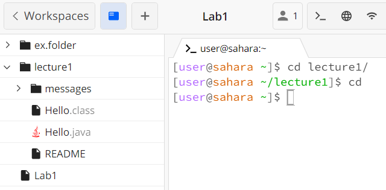
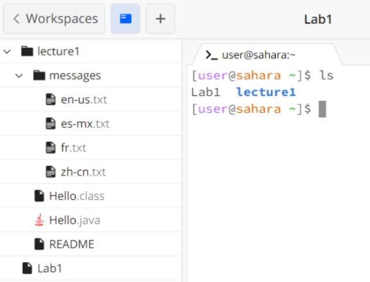
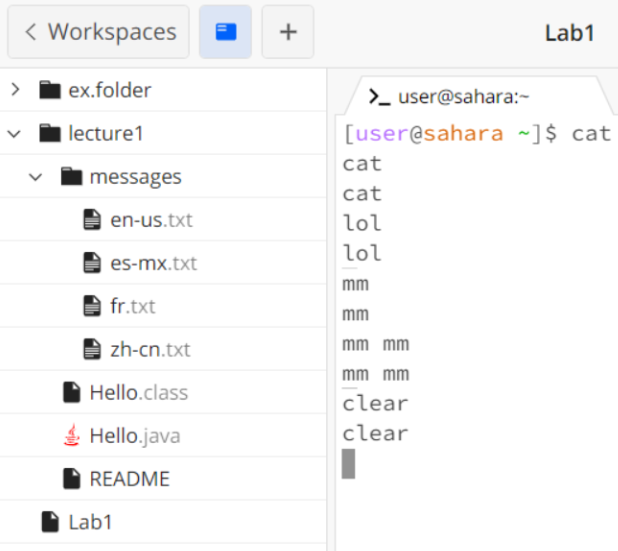
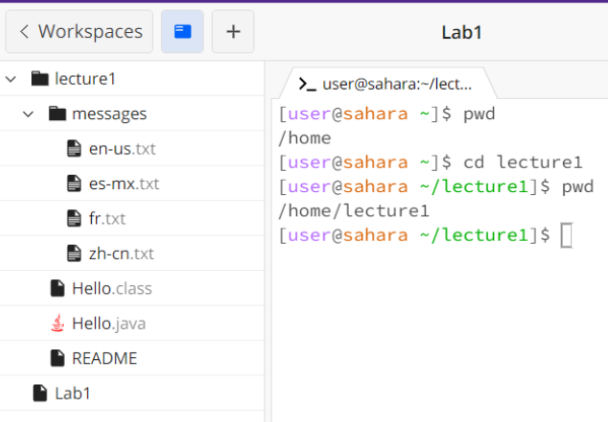
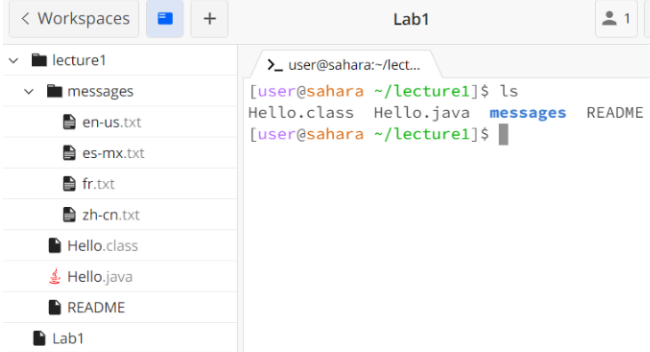
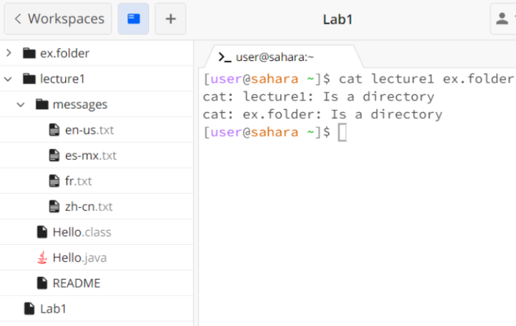
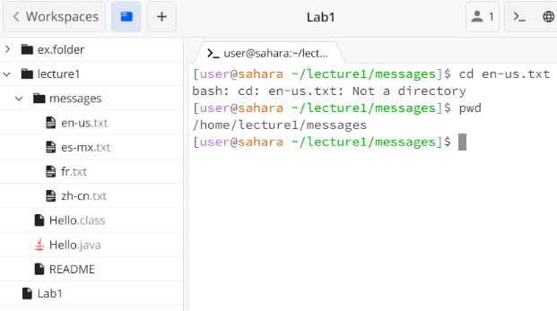
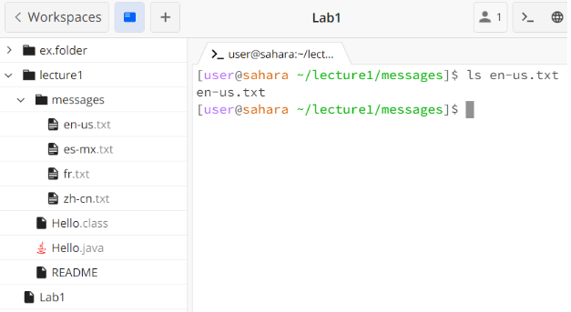
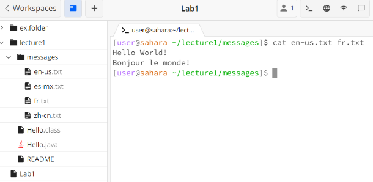

# week-1-lab-report

[**Commands**]

I will be explaining the usage of `cd` , `ls` , and `cat` through examples. 

< 1. *Examples using the command with* **no** *arguments* >

  a) `cd`
  

The `cd` command with no argument resets to `home` because there is no specified directory. When working in both the `home` directory and a different directory (`lecture1`), the `cd` command returned to the `home` directory. There is no error. 

  b) `ls`

The absolute directory is the `home` directory. In here, the `ls` command showcases a list of the files/folders working within the `home` directory, and the output of this command provides the two folders in the `home` directory, `Lab1` and `lecture1`. There is no error. 

  c) `cat` 

The absolute directory is the `home` directory. Since there is no argument, the terminal is empty and concatenates the String I input into the output—as a result, the inputted String is repeated in the output. There is no error. 

< 2. *Examples using the command with a path to a* `directory` *as an argument* >

  a) `cd`

The absolute is the `lecture1` directory. The `cd` function changed from the `home` directory to the `lecture1` directory, which can also be seen when we command `pwd` to showcase the absolute directory. There is no error. 

  b) `ls`

The absolute directory is the `lecture1` directory. The `ls` function provides the list of folders and files within the `lecture1` directory, which include `Hello.class`, `Hello.java`, `messages`, and `README`. There is no error. 

  c) `cat`

The absolute directory is the `home` directory. This produces an error because the contents of the directories, `lecture1` and `ex.folder`, cannot be concatenated, hence the output only demonstrates that the given paths are directories and nothing regarding its contents. There is an error. 

< 3. *Examples using the command with a path to a* **file** *as an argument* >

  a) `cd`

The absolute directory is the `messages` directory. The `cd` function only works for directories, therefore using the command with a path to a file as an argument creates an error since `en-us.txt` is a file, not a directory. There is an error.  

  b) `ls`

The absolute directory is the `messages` directory. The `ls` function intends to provide a list of the files/folders in a given path, but since `en-us.txt` is already a file, the output reiterates the name of the file. There is no error. 

  c) `cat`

  
The absolute directory is the `messages` directory. The `cat` function combines the contents of the two files, `en-us.txt` and `fr.txt`, and prints the contents of both files in the output, *“Hello World!”* and *“Bonjour le monde!”*. 
